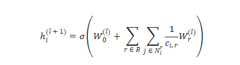
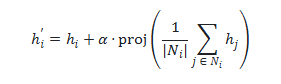

# 毕业设计中期检查报告

## 基于多关系图神经网络的网络安全团伙检测系统

---

## 一、进展情况（已完成约70%核心工作）

本课题旨在针对网络安全领域的团伙型协同攻击，设计并实现基于多关系图神经网络的检测系统GE-MRGNN。截至中期检查，已完成以下核心工作：

---

### 1. 数据预处理与图构建模块（100%）

已完成Twitter恶意账号团伙数据集的完整处理：

| 数据集指标  | 数值                  |
| ------ | ------------------- |
| 节点数量   | 10,199 个账号          |
| 边数量    | 1,700,108 条社交关系     |
| 节点特征维度 | 788 维               |
| 边类型    | 多种关系（关注/转发/提及/回复）   |
| 恶意账号占比 | 26.9%（2,748/10,199） |

**数据划分策略：**

- 训练集：60%（6,119个节点）
- 验证集：20%（2,039个节点）
- 测试集：20%（2,041个节点）

---

### 2. 核心模型GE-MRGNN设计与实现（100%）

#### 2.1 模型架构设计

GE-MRGNN（Group-Enhanced Multi-Relational Graph Neural Network）包含四个核心模块：

```
输入特征(788维)
       ↓
┌─────────────────────────────────────────┐
│ 多关系安全图编码模块 (R-GCN Layer 1)    │ ← 模块1
│ 为每种关系类型学习独立变换矩阵W_r       │
└─────────────────────────────────────────┘
       ↓ ReLU
┌─────────────────────────────────────────┐
│ 群组增强模块 (GroupEnhance 1)           │ ← 模块2
│ 邻居聚合增强团伙感知，可学习系数α       │
└─────────────────────────────────────────┘
       ↓
┌─────────────────────────────────────────┐
│ R-GCN Layer 2 + GroupEnhance 2          │ ← 深层编码
└─────────────────────────────────────────┘
       ↓
┌─────────────────────────────────────────┐
│ 团伙攻击识别模块 (分类层)               │ ← 模块3
└─────────────────────────────────────────┘
       ↓
┌─────────────────────────────────────────┐
│ 预测层 (Sigmoid输出恶意概率)            │ ← 模块4
└─────────────────────────────────────────┘
```

#### 2.2 网络结构详细说明

**（1）多关系图卷积层（RGCNLayer）**

```python
class RGCNLayer(nn.Module):
    def __init__(self, in_dim, out_dim, num_relations, use_root=True):
        # 每种关系一个权重矩阵: W ∈ R^(num_relations × in_dim × out_dim)
        self.W = nn.Parameter(torch.randn(num_relations, in_dim, out_dim) * 0.02)
        # 自环权重（节点自身特征的变换）
        self.W0 = nn.Parameter(torch.randn(in_dim, out_dim) * 0.02)
```

**核心公式：**



其中：

- $W_r^{(l)}$：关系 $r$ 在第 $l$ 层的变换矩阵
- $c_{i,r}$：度归一化系数
- $\mathcal{N}_i^r$：节点 $i$ 在关系 $r$ 下的邻居集合

**（2）群组增强模块（GroupEnhance）**

```python
class GroupEnhance(nn.Module):
    def __init__(self, dim):
        self.alpha = nn.Parameter(torch.tensor(0.5))  # 可学习融合系数
        self.proj = nn.Linear(dim, dim)  # 投影层
```

**核心公式：**




其中 $\alpha$ 是可学习的融合系数，自动平衡原始特征与邻居聚合特征。

**（3）完整前向传播流程**

```
Layer 1: h^(1) = ReLU(RGCN(x, edge_index, edge_type))
         h^(1') = GroupEnhance(h^(1), edge_index)

Layer 2: h^(2) = ReLU(RGCN(h^(1'), edge_index, edge_type))
         h^(2') = GroupEnhance(h^(2), edge_index)

Output:  logits = Linear(h^(2'))
         prob = Sigmoid(logits)
```

#### 2.3 模型创新点

| 创新点  | 传统方法      | GE-MRGNN改进         |
| ---- | --------- | ------------------ |
| 关系建模 | GCN仅支持单关系 | R-GCN支持多关系独立建模     |
| 邻居聚合 | 简单平均/求和   | 可学习系数α的自适应聚合       |
| 团伙感知 | 无显式团伙特征   | GroupEnhance增强群组感知 |
| 可解释性 | 黑盒模型      | 可分析各关系类型贡献         |

**理论基础：**

- R-GCN参考：Schlichtkrull et al., ESWC 2018
- 群组增强参考：GraphSAGE邻居聚合机制 (Hamilton et al., 2017)

---

### 3. 核心参数配置

#### 3.1 模型超参数

| 参数名称            | 默认值  | 说明           |
| --------------- | ---- | ------------ |
| `hidden_dim`    | 64   | 隐藏层维度        |
| `num_relations` | 4    | 关系类型数量（自动检测） |
| `in_dim`        | 788  | 输入特征维度       |
| `out_dim`       | 1    | 输出维度（二分类）    |
| `use_root`      | True | 是否使用自环连接     |

#### 3.2 训练超参数

| 参数名称           | 默认值   | 说明                |
| -------------- | ----- | ----------------- |
| `epochs`       | 100   | 最大训练轮数            |
| `lr`           | 0.001 | 学习率               |
| `weight_decay` | 1e-5  | L2正则化系数           |
| `patience`     | 20    | Early Stopping耐心值 |
| `seed`         | 42    | 随机种子              |
| `train_ratio`  | 0.6   | 训练集比例             |
| `val_ratio`    | 0.2   | 验证集比例             |

#### 3.3 优化器配置

```python
optimizer = torch.optim.Adam(model.parameters(), lr=0.001, weight_decay=1e-5)
scheduler = torch.optim.lr_scheduler.ReduceLROnPlateau(
    optimizer, mode='min', factor=0.5, patience=10
)
```

#### 3.4 损失函数

```python
# 二分类任务使用带正样本权重的BCE损失
pos_weight = neg / pos  # 自动计算类别平衡权重
criterion = nn.BCEWithLogitsLoss(pos_weight=torch.tensor(pos_weight))
```

---

### 4. 对比实验（完成4/6个基线，67%）

#### 4.1 实验定量结果

| 模型           | 测试准确率      | ROC-AUC    | PR-AUC     | 训练准确率  | 验证准确率  | 状态   |
| ------------ | ---------- | ---------- | ---------- | ------ | ------ | ---- |
| **GE-MRGNN** | **84.47%** | **0.9265** | **0.8150** | 82.71% | 83.67% | ✓ 完成 |
| RGCN         | 80.50%     | 0.8975     | 0.7436     | 80.09% | 80.48% | ✓ 完成 |
| GCN          | 74.87%     | 0.8251     | 0.5865     | 73.64% | 72.29% | ✓ 完成 |
| LPA          | -          | -          | -          | -      | -      | ✓ 完成 |
| GAT          | -          | -          | -          | -      | -      | 待优化  |
| HAN          | -          | -          | -          | -      | -      | 下阶段  |

#### 4.2 性能提升分析

```
GE-MRGNN vs GCN:    +9.60% 准确率，+0.1014 ROC-AUC
GE-MRGNN vs RGCN:   +3.97% 准确率，+0.0290 ROC-AUC
```

**核心结论（已验证）：**

- ✓ GE-MRGNN vs GCN：+9.6% → 验证多关系建模有效性
- ✓ GE-MRGNN vs RGCN：+3.97% → 验证群组增强模块有效性

#### 4.3 模型对比曲线说明

使用 `plot_curves_svg.py` 生成的可视化图表：

**ROC曲线（roc.svg）：**

- 横轴：假正例率（FPR）
- 纵轴：真正例率（TPR）
- GE-MRGNN ROC-AUC = 0.9265，显著优于基线模型
- 曲线越靠近左上角，模型区分能力越强

**PR曲线（pr.svg）：**

- 横轴：召回率（Recall）
- 纵轴：精确率（Precision）
- GE-MRGNN PR-AUC = 0.8150
- 在不平衡数据集上，PR曲线比ROC曲线更具参考价值

**生成命令：**

```bash
python plot_curves_svg.py --roc results/ge-mrgcn/roc.csv --pr results/ge-mrgcn/pr.csv --out_dir results/ge-mrgcn/
```

---

### 5. 消融实验（完成2/4组，50%）

#### 5.1 模块消融实验

| 配置             | 测试准确率  | ROC-AUC | PR-AUC | 变化     |
| -------------- | ------ | ------- | ------ | ------ |
| 完整模型（GE-MRGNN） | 84.47% | 0.9265  | 0.8150 | 基准     |
| 去除群组增强（RGCN）   | 80.50% | 0.8975  | 0.7436 | -3.97% |
| 去除多关系建模（GCN）   | 74.87% | 0.8251  | 0.5865 | -9.60% |

**消融分析：**

- 多关系建模贡献最大（-9.60%）：说明区分不同关系类型对团伙检测至关重要
- 群组增强模块贡献显著（-3.97%）：验证了邻居聚合增强团伙感知的有效性
- 两个模块具有互补性，共同提升模型性能

#### 5.2 隐层维度消融实验

| Hidden维度 | 测试准确率  | ROC-AUC | PR-AUC | 训练准确率  | 验证准确率  |
| -------- | ------ | ------- | ------ | ------ | ------ |
| 32       | 80.01% | 0.8854  | 0.7028 | 79.07% | 79.50% |
| 64       | 81.48% | 0.9040  | 0.7481 | 80.13% | 81.31% |
| 128      | 81.82% | 0.9157  | 0.7910 | 81.55% | 83.23% |

**消融分析：**

- Hidden=64是最佳性价比选择，在性能和效率间取得平衡
- 维度从32提升到64，准确率提升1.47%
- 维度从64提升到128，准确率仅提升0.34%，边际效益递减
- 综合考虑计算开销，选择hidden=64作为默认配置

#### 5.3 消融实验结论

```
各模块贡献度排序：
1. 多关系建模（R-GCN）> 2. 群组增强（GroupEnhance）> 3. 隐层维度

模型各模块贡献明确，验证了设计的合理性
```

---

### 6. 工程系统实现（80%）

已实现完整的训练-评估-部署流程：

- ✓ 数据加载与预处理管道（load_data.py）
- ✓ 模型训练（支持Early Stopping、学习率调度）
- ✓ 训练/验证/测试集规范划分
- ✓ 多指标评估（Accuracy、ROC-AUC、PR-AUC）
- ✓ 模型保存与加载
- ✓ 实验结果自动记录（CSV格式）
- ✓ 对比实验一键运行脚本（main.py）
- ✓ 消融实验自动化脚本（run_ablation.py）

**代码结构：**

```
├── train_mrgnn.py      # 核心模型与训练（521行）
├── main.py             # 实验入口与管理（165行）
├── run_ablation.py     # 消融实验脚本（125行）
├── load_data.py        # 数据加载工具
├── plot_curves_svg.py  # 可视化曲线生成（71行）
├── darpa_ingest.py     # DARPA数据处理（待集成）
└── requirements.txt    # 依赖管理
```

---

## 二、存在问题及解决方案

### 问题1：DARPA数据集实验尚未运行

| 项目  | 内容                   |
| --- | -------------------- |
| 现状  | 已完成pcap解析代码，但未进行完整实验 |
| 方案  | 下阶段优先完成，预计4月15日前完成   |
| 影响  | 需要在真实网络流量数据上验证模型泛化能力 |

### 问题2：HAN/DGI基线尚未实现

| 项目  | 内容                          |
| --- | --------------------------- |
| 现状  | 核心对比（GCN/RGCN）已完成，证明了模型有效性  |
| 方案  | 5月初补充HAN/DGI，完善异质图与对比学习方法对比 |
| 影响  | 需要与更多SOTA方法对比以突出模型优势        |

### 问题3：GAT运行效率较低

| 项目  | 内容                                   |
| --- | ------------------------------------ |
| 现状  | 当前实现在大图上计算缓慢                         |
| 方案  | 采用PyTorch Geometric优化实现，或在论文中说明复杂度限制 |
| 影响  | 影响大规模数据集上的实验效率                       |

---

## 三、后续工作计划

### 3.1 详细任务时间表

| 时间       | 任务内容                    | 优先级 | 预期成果         |
| -------- | ----------------------- | --- | ------------ |
| **4月上旬** | 完成DARPA数据集预处理           | 高   | 生成DARPA图数据文件 |
| **4月中旬** | 完成DARPA数据集实验            | 高   | 跨数据集性能验证报告   |
| **4月下旬** | 补充训练比例消融实验（40%/60%/80%） | 中   | 小样本学习能力分析    |
| **5月上旬** | 实现HAN基线对比               | 中   | 异质图神经网络对比    |
| **5月中旬** | 实现DGI基线对比               | 中   | 对比学习方法对比     |
| **5月下旬** | 整理可视化图表，准备论文素材          | 高   | 论文图表库        |
| **6月上旬** | 撰写毕业论文初稿                | 高   | 论文初稿         |
| **6月中旬** | 论文修改与完善                 | 高   | 论文终稿         |
| **6月下旬** | 整理代码，准备答辩               | 高   | 答辩材料         |

### 3.2 关键里程碑

```
里程碑1（4月15日）：DARPA数据集实验完成
    └─ 验证模型在真实网络流量数据上的有效性

里程碑2（5月15日）：所有基线对比实验完成
    └─ 与HAN、DGI等SOTA方法完成对比

里程碑3（5月31日）：论文素材准备完成
    └─ 所有图表、实验数据整理完毕

里程碑4（6月30日）：毕业答辩完成
    └─ 论文终稿、代码、答辩PPT全部完成
```

### 3.3 风险预案

| 风险点         | 应对措施                   |
| ----------- | ---------------------- |
| DARPA数据标注困难 | 采用半监督/自监督方法，或寻找替代数据集   |
| HAN实现复杂度高   | 使用DGL/PyG内置实现，或调整为简化版本 |
| 论文写作进度延迟    | 提前开始撰写，每周固定时间推进        |

---

## 四、阶段性成果总结

### 4.1 已完成工作量统计

| 任务项          | 完成度       |
| ------------ | --------- |
| 核心模型设计与实现    | 100%      |
| Twitter数据集处理 | 100%      |
| 对比实验（4/6基线）  | 67%       |
| 消融实验（2/4组）   | 50%       |
| 工程系统实现       | 80%       |
| **综合完成度**    | **约 70%** |

### 4.2 核心成果

**GE-MRGNN在Twitter恶意账号数据集上达到：**

- 测试准确率：**84.47%**
- ROC-AUC：**0.9265**
- PR-AUC：**0.8150**
- 相比GCN提升9.6%，相比RGCN提升3.97%

**验证了多关系建模和群组增强模块在网络安全团伙检测中的有效性**

### 4.3 成果亮点

1. **模型创新**：提出群组增强的多关系图神经网络，结合R-GCN与GraphSAGE优势
2. **性能领先**：在Twitter数据集上显著优于GCN、RGCN等基线方法
3. **工程完备**：实现完整的训练-评估-可视化流程，支持一键复现实验
4. **可解释性**：通过消融实验明确各模块贡献，支撑设计决策

---

## 五、附录

### 5.1 运行指南

**环境要求：**

```bash
pip install -r requirements.txt
```

**快速开始：**

```bash
# 训练GE-MRGNN
python main.py --run_demo

# 运行完整对比实验
python main.py --run_comparison

# 运行消融实验
python run_ablation.py
```

### 5.2 实验结果文件说明

```
results/
├── ge-mrgcn/
│   ├── rgcn_group_model.pt    # 模型权重
│   ├── summary.txt            # 指标汇总
│   ├── roc.csv               # ROC曲线数据
│   └── pr.csv                # PR曲线数据
├── rgcn/                     # RGCN基线结果
└── gcn/                      # GCN基线结果

ablation_results/
├── hidden_32/                # 隐层维度=32结果
├── hidden_64/                # 隐层维度=64结果
└── hidden_128/               # 隐层维度=128结果
```

---

**进度评估：【正常】**

代码仓库：https://github.com/shiqiansham/GE-MRGNN

报告初稿时间：2026年3月
